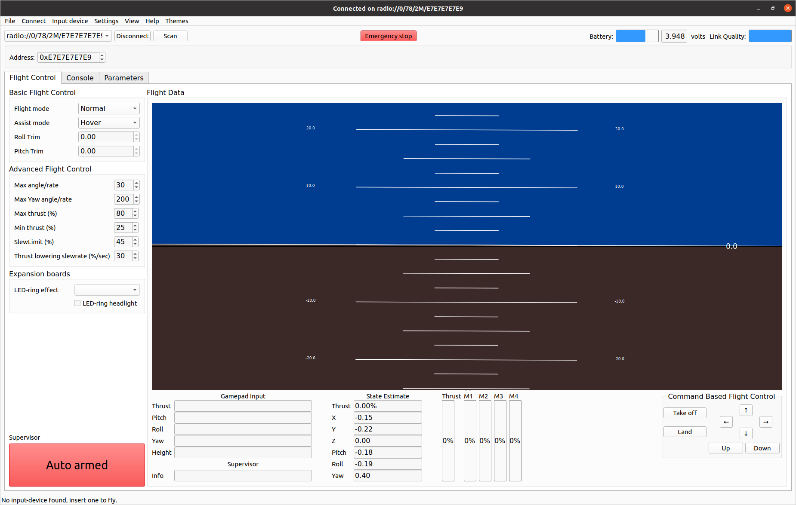
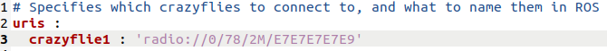

# Startup Guide
Follow this guide to start the Braitenfly project.

## Start the virtual machine & connect to the radio
This step is only required if you are using a computer running Windows. Skip this step if you are using a machine running Ubuntu.

1. Open Vmware Workstation Player either by clicking the desktop icon or by searching `Vmware` using the Windows search function.

   

2. Run the virtual machine by double-clicking on the `crazyflie` virtual machine. 

   

3. Wait for the virtual machine to startup and then login. The password is `crazyflie`.

4. Connect the Crazyflie radio. Click `Player > Removable Devices > Nordic ASA Crazyradio 2.0 > Connect (Disconnect from host)` in the top left. You may see a warning popup that informs you that the radio is being disconnected from you host machine. Afterward, verify that the Crazyflie radio shows up in the list of connected device (should have a check mark next to it under `Player > Removable Devices`).

   

## Scan for Crazyflies & test connection/flight status
In this section, you will ensure your crazyflie and radio are working correctly, and that you can successfully connect to your crazyflie.
1. Turn your crazyflie on.

2. Open a terminal window using the keyboard shortcut `ctrl + alt + T`

3. Run the command `cfclient`. You should see a window pop up.

   

4. Click the `Scan` button at the top left. You should see a Crazyflie ID appear. Note that sometimes the Crazyflie ID will already be found, and clicking `Scan` will not be needed. Note down this full interface ID. It should look something like this `radio://0/78/2M/E7E7E7E7E9'`.

   

5. Click `Connect`. You should see `connected` appear at the top-middle of the window, as well as a few other changes. Note the red emergency stop button is now available. If you pick up your drone and rotate it you should see the blue/black  attitude visualizer start to move.

   

6. At this point you may fly the drone using the controls in the bottom right. Once the drone is in a safe & level location, start by clicking `Take off`. You may then use the arrows, and up/down keys to move the drone. When finished, click `Land` to land the drone in a safe location.

7. Exit the client.

## Start the Crazyflie server
This step will connect your crazyflie to your machine without `cfclient` & is required to run the *Braitenfly* modules.

1. Ensure `cfclient` has closed. You may need to close the terminal window you used to start it.

2. Navigate to `/home/catkin_ws/src/rospy_crazyflie/config` and open `config.yaml` in a text editor by double-clicking.  Edit the `crazyflie1` ID to match the ID that appeared in `cfclient`. You only have to change this once everytime you want to use a new Crazyflie drone, otherwise this can be left alone.

   

3. Open a new terminal window and run `roslaunch rospy_crazyflie default.launch`. Within about 10 seconds the terminal should print `Connected to radio://0/78/2M/E7E7E7E7E9`. If you don't see this print, or there are other errors, double check that you correctly entered the crazyflie ID in the `config.yaml` file, that your crazyflie is on, and that you radio is connected to the virtual machine (and not the host).

   

4. **If you Crash**. If you happen to crash you crazyflie, you will likely have to restart this service by clicking `ctrl + C` in the terminal window used to run `roslaunch rospy_crazyflie default.launch`, and then rerunning the command.

## Running Braitenfly
Running *Braitenfly* will activate certain reflexes in your crazyflie drone. These reflexes 
will do things like cause your crazyflie to move or make sounds based things it's environment. 
These reflexes are programmed as 'modules' that the user can modify.

1. **Edit active modules**. Navigate to `/home/crazyflie/catkin_ws/src/braitenfly/config` and open `braitenfly_config.yaml` by double-clicking. This file sets what modules are activated when *Braitenfly* is running. You choose what modules to activate/deactivate by modifying the `modules` list. Placing a `#` in front of a module will deactivate it. In this example, only the modules `buzzer_frontrangefinder` & `orient_rangefinders` are active.

    

2. **Edit module parameters**. In the same `braitenfly_config.yaml` file you can edit module parameters. Each module has a corresponding list of parameters (which are typically numbers) that affect the behavior of the module. For instance, the `approach_frontrangefinder` module has three parameters, which affect the thresholds for approaching objects. The user can customize these parameters, although it is recommended to start with the defaults.

      

3. **Run Braitenfly & fly drone**. Place your drone in a safe & level area. Open a new terminal and run the command `rosrun braitenfly braitenfly.py --takeoff=1 --buzzer=1`. This will initialize *Braitenfly* and cause your drone to takeoff with the modules in `braitenfly_config.yaml` active.

4. **Landing**. To land, place your hand (or other object) over the top of the crazyflie.

5. **Run Braitenfly without taking off**. If you want to run *Braitenfly* without taking off, and/or without the buzzer active you can change the `takeoff` and/or `buzzer` values to 0 and rerun `rosrun braitenfly braitenfly.py --takeoff=0 --buzzer=0`.

6. Note that anytime you want to change modules/parameters you must restart *Braitenfly*. First land the crazyflie, then click `ctrl + C` in the window used to run `rosrun braitenfly braitenfly.py`, and then rerun the command. You will also have to do this in the event of a crash. Note that you may also have to restart you crazyflie drone.

## Troubleshooting

### Turning off the buzzer
In the event of a crash, sometimes the buzzer may be stuck in an `on` state. To stop it, open a new terminal and run
`rosservice call /play_buzzer '{number: 0, frequency: 1000, duration: 0.01, stop: 1}'
`
`

